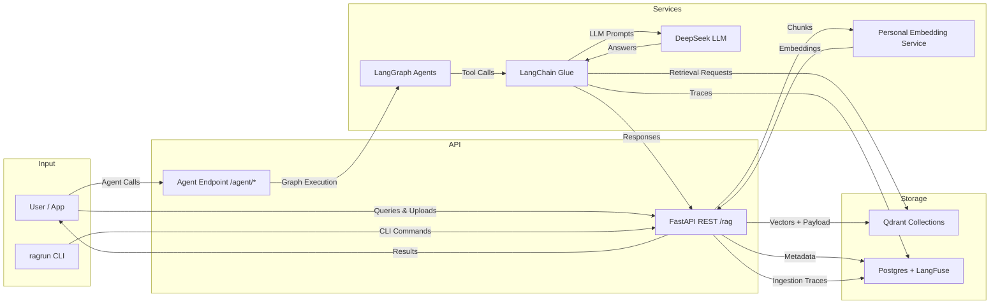

# LangChain + Qdrant Plan for `ragrun`

## A. Overview (What we want to achieve in the end)
A flexible, scalable RAG platform for personalized knowledge queries (books, essays, typologies, concepts) centered on assistants like `@philo-von-freisinn` from `ragkeep/assistants/philo-von-freisinn/assistant-manifest.yaml`.

**Goals**
- Simple ingestion path from docs (PDF, CSV, YAML manifests) -> chunks (produced by `@ragChunk` as JSONL) -> embeddings -> Qdrant.
- Smarter retrieval via LangGraph agents (book-focused flows, reranking, branching).
- Observability through LangFuse so we can iterate quickly on ingestion and retrieval traces.
- Flexibility: swap embedder/LLM/vector DB in under an hour by keeping LangChain wrappers at the config boundary only.
- Deployment targets: local + cloud via Docker Compose, CLI for maintenance, REST API for apps and `ragprep@commands` ingestion jobs.
- End state: multiple agents like `philo-von-freisinn` agent that turns Qdrant chunks (books + augmented data) into contextual answers such as "Explain typology X with examples from book Y."
- Guiding Principle: Use LangChain for the brain and nervous system – never for the eyes, ears or hands.

## B. Technology Walkthrough
- **LangChain (the conductor)**: Orchestrates REST + CLI flows with Qdrant, the personal embedding service, DeepSeek LLM, and LangFuse. We use it for glue (PromptTemplate, tool calling, structured outputs) and agents; ingestion stays raw Python without vector store wrappers.
- **LangFuse (the observer)**: Captures ingestion metrics (embedding latency, upsert errors) and retrieval traces (scores, prompts). Exports into Postgres for dashboards and evaluation sets.
- **LangGraph (the pathfinder)**: Builds admin and retrieval agents as StateGraphs with `MessagesState`, enabling branching, looping, streaming, and human-in-the-loop. Supervisor nodes route into conditional subgraphs (e.g., `query_type == "book"`).
- **Qdrant (the librarian)**: Vector DB with hybrid search (dense + sparse). Runs locally via Docker >=1.10 with HNSW tuned to `m=64`, `ef_construct=512`, `ef_search=128`. Separate collections per type (`books`, `concepts`, `talks`) allow targeted tuning.
- **Personal Embedding Service (the data tagger)**: FastAPI microservice running the local `T-Systems-onsite/cross-en-de-roberta-sentence-transformer` (768 dims) for high-quality German/English embeddings. Supports GPU batching and can swap to OpenAI or Mistral via config only.
- **Postgres DB**: Stores LangFuse activity, agent manifests, and optional analytics (chunk metadata, stats). SQLAlchemy models mirror `ragrun_old/plans/CHUNK_METADATA_MODEL.md`.
- **DeepSeek API (default LLM)**: Preferred reasoning models according to task (`deepseek-chat` or `deepseek-reasoner` via `langchain-deepseek.ChatDeepSeek`) wrapped in a custom `BaseChatModel` subclass with retries, streaming, and env-driven switching to Groq or Anthropic.
- **Deployment Fabric**: Docker Compose for local parity; Railway (or similar) for cloud. Services: `ragrun` FastAPI, Qdrant, Postgres, embedding service, LangFuse.

## C. The Data-Model
- Chunking happens externally via `@ragChunk` (deterministic) and produces JSONL files that the `@ragUpload` client sends through the CLI/REST API.
- Every chunk is stored as a single Qdrant point; embeddings are produced by the personal embedding service (currently 768-dim cross-lingual transformer).

```json
{
  "id": "uuid",
  "text": "Chunk content (<=512 tokens)",
  "metadata": {
    "author": "Immanuel Hermann Fichte",
    "source_id": "philo-book1",
    "source_title": "System der Ethik",
    "source_index": 5,
    "segment_id": "chapter-03",
    "segment_title": "Zur Methodik",
    "segment_index": 2,
    "parent_id": null,
    "chunk_id": "philo-book1-chunk-0005",
    "chunk_type": "book",
    "worldview": "Idealismus",
    "importance": 5,
    "content_hash": "sha256:...",
    "created_at": "2025-12-04T12:00:00Z",
    "updated_at": "2025-12-04T12:00:00Z",
    "source_type": "book",
    "tags": ["philosophy", "typology"],
    "language": "de"
  },
  "embedding": [0.1, 0.2, ...]
}
```

- Validation: shared Pydantic model identical to `CHUNK_METADATA_MODEL.md` (fields `author` through `language` as listed in §3, plus `tags` for downstream filtering).
- Collections: segmented per type (`books_collection`, `concepts_collection`) for targeted filters and HNSW params.
- Qdrant payload stays flat (no nested objects) to keep filter performance predictable.

## D. REST API
**Ingestion (existing contracts)**
- `POST /rag/upload` (`@ragUpload`): expects `{ collection, chunks[] }`. Flow: (1) schema validation, (2) dedupe via `chunk_id` + `content_hash`, (3) batch embedding through the personal service (64 per batch), (4) Qdrant upsert (auto-create collection), (5) optional Postgres mirror, (6) emit LangFuse traces.
- `DELETE /rag/delete` (`@ragDelete`): `{ collection, chunk_ids[], cascade }`. Removes Qdrant points and optionally dependent summaries (`parent_id`). Syncs Postgres analytics when enabled.
- `GET /rag/books` (`@ragListBooks`): aggregates metadata grouped by `source_id` via Qdrant scroll or Postgres view. Filters: `worldview`, `language`, `assistant`.
- `GET /rag/collections` (`@ragListCollections`): proxies Qdrant `/collections` and augments with counts + `last_ingested_at`.

**Retrieval (new)**
- `POST /rag/query`: body `{ query, n_results=5, filters }`. Steps: embed query -> Qdrant search -> optional rerank -> DeepSeek response with citations. Filters on `chunk_type`, `worldview`, `importance`.
- `POST /rag/query-advanced`: hybrid dense + BM25/Postgres search with prefetch + rescore pipeline; response includes score breakdown.

**Agents (new)**
- `POST /agent/{agent_name}`: spins up a LangGraph agent (e.g., `/agent/philo-von-freisinn`) with streaming output and LangFuse tracing. Auth via API key, per-device rate limiting.

## E. CLI
- `ragrun ingest --file philo-manifest.yaml`: loads manifest, resolves assets, streams JSONL chunks to the REST endpoint.
- `ragrun analytics --collection books`: prints chunk counts, score distribution, and last update time (Qdrant + Postgres).
- `ragrun monitor`: tails LangFuse streams (ingestion + retrieval) for live debugging.
- `ragrun agent define --name philo --manifest path.yaml`: stores or updates an agent manifest in Postgres.
- `ragrun health`: verifies connectivity to Qdrant, LangFuse, embedding service, and DeepSeek LLM.

## F. Agents in LangGraph
- Agents live as YAML manifests in Postgres (aligned with `ragkeep/assistants/.../assistant-manifest.yaml`). At startup `ragrun` loads the manifests, builds LangGraph StateGraphs, and wires in tools (retriever, concept explainer, admin operations).

```yaml
name: philo-von-freisinn
description: Philosophy retrieval with typology focus
llm: deepseek-chat
memory: postgres_checkpointer
tools:
  - qdrant_retriever
  - concept_explainer
branches:
  - book_retrieval
  - typology_augment
  - admin_maintenance
settings:
  retriever:
    collection: books_collection
    metadata_filter:
      chunk_type: book
```

- Ingestion hooks: deploying an agent can automatically ensure referenced collections exist.
- Runtime path: LangGraph `create_react_agent` + `MemorySaver` for persistent dialogues stored via Postgres checkpointing.
- Admin agent: handles maintenance commands ("reindex collection", "sync manifest") through `qdrant_admin` and `ragprep_cli` tools.

## G. Branches in LangGraph
- Supervisor node classifies each query (`book`, `concept`, `typology`, `maintenance`). Conditional edges route into dedicated subgraphs.
- **Book branch**: nodes = `query_embed` -> `qdrant_retrieve (chunk_type=book)` -> `rerank` -> `llm_generate`. A fallback edge triggers `broad_search` when scores fall below threshold.
- **Typology branch**: combines `concept_retrieve` (concept collection) + `augment_context` (typology definitions) -> `llm_generate` with the prompt "Compare this typology with book context."
- **Reflection branch**: after `llm_generate`, a `self_critique` node evaluates confidence; if low, control loops back into retrieval with expanded filters.
- The branch graph is stored as YAML plus LangGraph builder code so LangFuse can display branch traces end-to-end.

## H. Observability with LangFuse
- **Ingestion traces** (`dataset: ingestion_runs`): batch id, chunk count, embedding latency, Qdrant upsert duration, errors.
- **Retrieval traces** (`dataset: query_evals`): query embedding time, search scores, filters used, LLM inputs/outputs, total latency.
- **Agent traces** (`dataset: agent_paths`): branch decisions, tool calls, memory state transitions, human-in-the-loop events.
- Integration uses `LANGFUSE_*` env vars and a LangChain `CallbackHandler`. All traces land in LangFuse/Postgres; export scripts create evaluation sets (e.g., 100 sample queries scored via BLEU/ROUGE or LLM-as-judge relevance).

## I. Data Flow



**Explanation**: Data flows from API/CLI inputs through embeddings straight into Qdrant. LangChain/LangGraph orchestrate retrieval and agents while LangFuse/Postgres capture every event for debugging, monitoring, and evaluation.

## J. Future thoughts

Minor weaknesses / things I would tweak (none are deal-breakers)

| Issue | Severity | Suggested improvement |
| --- | --- | --- |
| Single embedding model hard-coded | Low | Make the embedding model per-collection or per-agent configurable (you’re 90 % there already with the service). Add an `embedding_model` field on each collection manifest. |
| No explicit reranking stage yet | Medium | You already planned the rerank node, but it lacks a concrete reranker. Add Cohere Rerank, bge-reranker, or Jina to the personal embedding service; even a small cross-encoder on GPU would noticeably improve relevance for philosophy texts. |
| BM25 / sparse search is mentioned but not fully fleshed | Low–Medium | Qdrant ≥1.10 ships fast BM25. Make hybrid search (dense α + sparse 1−α) the default for `/rag/query-advanced` and expose α as a parameter. |
| No parent-child / hierarchical retrieval yet | Medium | Metadata already has `parent_id`, but there’s no graph navigation. Add a recursive “context expansion” tool that retrieves parent/child/sibling chunks so agents can move from a chapter summary to surrounding sections. |
| DeepSeek-only LLM (for now) | Low | The wrapper abstraction is in place—add Groq Llama-3.1-70B or Claude 3.5 Sonnet as failover models with automatic routing based on token length, latency, or cost. |