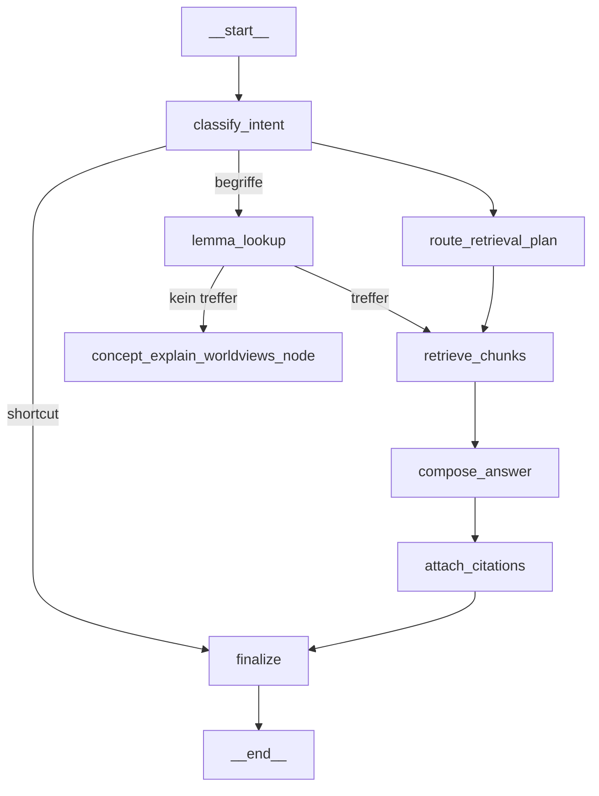

# Analyse: Assistenten-Chat fuer "Philo von Freisinn"

Ziel dieses Dokuments: Eine erste technische Analyse fuer einen DeepSeek-aehnlichen Chat in der Assistenten-Seite (Startfall: "Philo von Freisinn") und ein sofort nutzbarer Prompt fuer Cursor.ai mit Claude Sonnet 4.6.

## Analyse Version 1.0 (codebase-basiert)

---

## 1. Zielbild

Auf der Assistenten-Seite (z.B. "Philo von Freisinn") erscheint neben dem `Statistik`-Button ein
`Chat`-Button. Ein Klick oeffnet eine Thread-Ansicht, in der User-Nachrichten und Assistenten-
Antworten chronologisch dargestellt werden – dem UX-Muster von https://chat.deepseek.com/
nachempfunden.

**Kernprinzipien:**
- Jede Eingabe wird zuerst klassifiziert (Intent), danach an den passenden Retrieval-Pfad gerouted.
- Antworten basieren ausschliesslich auf der RAG-Collection des jeweiligen Assistenten.
- Jede Antwort enthaelt Quellenverweise (Buch / Vortrag / Chunk-ID), analog zu den
  vorhandenen `context_refs` im `event_content`-Log.
- Conversation-Kontext (letzter N Turns) wird fuer korrekte Pronomen-Aufloesung mitgefuehrt.
- Halluzinationsschutz durch Confidence-Scoring und defensivere Formulierung bei
  schlechter Evidenzlage.

---

## 2. Ist-Zustand des ragrun-Repos (relevante Bausteine)

> **Stand nach Refactoring (Maerz 2026):** Obsolete Schichten wurden entfernt.
> Siehe Abschnitt 2a fuer Details.

Die folgenden Infrastrukturbausteine koennen direkt wiederverwendet werden:

| Baustein | Datei | Relevanz fuer Chat |
|---|---|---|
| `dense_retrieve` / `sparse_retrieve` / `hybrid_retrieve` | `app/retrieval/utils/retrievers.py` | Kernretrieval, unveraendert nutzbar |
| `rerank_by_embedding` | `app/retrieval/utils/retrievers.py` | Embedding-Reranking nach RRF-Fusion |
| `build_context` | `app/retrieval/utils/retrievers.py` | Kontextstring + `chunk_id`-Referenzen |
| `payload_filter` | `app/retrieval/utils/retrievers.py` | Weltanschauungs- und chunk_type-Filter |
| `_retrieve_with_widen` | `app/retrieval/graphs/concept_explain_worldviews.py` | Widening-Logik bei duennen Ergebnissen |
| `_chat_with_retry` | `app/retrieval/graphs/concept_explain_worldviews.py` | Retry + Sentence-Completion-Logik |
| `EventRecorder` / `GraphEventRecorder` | `app/retrieval/services/event_recorder.py` | Dual-Write-Logging (permanent + 7d-Rotation) |
| `event_metadata` / `event_content` | `app/db/tables.py` | Log-Tabellen – koennen direkt erweitert werden |
| `load_system_prompt()` | `app/retrieval/prompts/philo_von_freisinn.py` | Laedt Philo-Persona aus `ragkeep/assistants/philo-von-freisinn/prompts/instruction.prompt` |
| `DeepSeekClient` | `app/infra/deepseek_client.py` | LLM-Client |
| `EmbeddingClient` | `app/infra/embedding_client.py` | Embedding-Service |
| `QdrantClient` | `app/infra/qdrant_client.py` | Vektordatenbank |
| `CHUNK_TYPE_ENUM` | `app/shared/models.py` | Alle gueltigen chunk_types |

**Relevante chunk_types** (aus `app/shared/models.py`):
`book`, `secondary_book`, `chapter_summary`, `begriff_list`, `talk`, `talk_summary`,
`essay`, `essay_summary`, `quote`, `explanation`, `explanation_summary`, `typology`

### 2a. Refactoring-Stand (Maerz 2026)

Vor der Chat-Implementierung wurden obsolete und gebrochene Teile entfernt:

| Geloeschte Datei | Grund |
|---|---|
| `app/api/concept_explain.py` | Kaputte Imports; nie in `main.py` eingebunden |
| `app/retrieval/graphs/philo_von_freisinn.py` | Thin-Wrapper um alten, simpleren Chain; ersetzt durch `concept_explain_worldviews` |
| `app/retrieval/chains/concept_explain.py` | Alter Chain ohne Retry, Hybrid, Worldview-Filter |
| `app/retrieval/services/concept_explain_service.py` | Service fuer alten Chain; nicht eingebunden |
| `app/services/concept_explain_service.py` | Re-Export-Shim des obigen |
| `app/retrieval/api/essay_finetune.py` | Disabled, inkompatibel mit aktueller Implementierung |
| `app/retrieval/chains/essay_finetune.py` | Dto. |
| `app/retrieval/services/essay_finetune_service.py` | Dto. |
| `app/retrieval/services/retrieval_logging.py` | Ersetzt durch `EventRecorder` / `GraphEventRecorder` |

`GraphEventRecorder` wurde dabei verschlankt: delegiert jetzt sauber an `EventRecorder`
ohne eigene Logging-Logik.

---

## 3. Architekturentscheidung: LangGraph (Variante B) ✅ Beschlossen

**Entscheidung (Maerz 2026):** Der Chat-Graph wird von Anfang an mit der offiziellen
`langgraph`-Library gebaut. Spike-Ergebnisse haben alle Kernfragen positiv beantwortet.

### Begruendung

| Kriterium | Bewertung |
|---|---|
| Streaming out-of-the-box | `graph.astream_events(version="v2")` liefert Token-Events direkt aus LLM-Nodes – kein Umbau noetig |
| Persistence out-of-the-box | `MemorySaver` → `AsyncPostgresSaver` ist ein Drop-in; keine Alembic-Konflikte |
| Konditionaler Routing | `add_conditional_edges()` sauber und transparent |
| Retry-Loops | Native LangGraph-Feature, kein eigener asyncio-Boilerplate |
| Lernkurve einmalig | Nach Spike bereits bekannt; zahlt sich fuer alle kuenftigen Graphen aus |

### Spike-Ergebnisse (Maerz 2026)

Der Spike unter `spike/` hat folgende Fragen positiv beantwortet:

- **Graph-Struktur:** `StateGraph` mit `TypedDict`-State, 3 Nodes und konditionalen Edges laeuft stabil.
- **DeepSeek + langchain-openai:** `ChatOpenAI` mit `openai_api_base=deepseek_url` funktioniert.
  Hinweis: `with_structured_output()` muss mit `method="json_mode"` aufgerufen werden –
  DeepSeek unterstuetzt `json_schema`-Format noch nicht.
- **Token-Streaming:** `astream_events(version="v2")` gibt `on_chat_model_stream`-Events
  Token fuer Token aus – direkt als SSE nutzbar.
- **MemorySaver Persistence:** `aget_state()` gibt Thread-State nach dem ersten Turn korrekt
  zurueck (`Messages: 1`).
- **Boilerplate:** 3 Nodes + State + konditionaler Edge = ~130 Zeilen sauberer Code.

### Technischer Stack

```
langchain-openai   →  ChatOpenAI (DeepSeek-kompatibel, Streaming)
langgraph          →  StateGraph, TypedDict-State, add_conditional_edges
langgraph-checkpoint-postgres  →  AsyncPostgresSaver (Produktion)
langgraph          →  MemorySaver (Tests / Spike)
```

### DeepSeek-Besonderheit

```python
# So (funktioniert):
llm.with_structured_output(MyModel, method="json_mode")

# Nicht so (400 Bad Request von DeepSeek):
llm.with_structured_output(MyModel)  # default: json_schema
```

System-Prompt muss bei `json_mode` explizit auf JSON-Output hinweisen.

---

## 4. Intent-Klassifikation (vor Retrieval)

### Intent-Schema (multi-label)

| Intent-Label | Beschreibung | Beispiele |
|---|---|---|
| `begriff_definieren` | Definition/Erklaerung eines Konzepts – zweistufig (siehe Abschnitt 5) | "Was ist Pneumatismus?" / "Erklaere den Begriff Aetherleib" |
| `werk_lokalisieren` | Buch- / Vortragslookup | "In welchem Vortrag spricht Steiner ueber das Aetherleib?" |
| `zitat_suchen` | Wörtliche oder sinngemaeße Zitate | "Hast du ein Zitat zum Tema Karma?" |
| `vergleich` | Zwei Konzepte / Weltanschauungen vergleichen | "Unterschied Materialismus vs. Spiritualismus?" |
| `erklaerung_vertiefung` | Ausfuehrliche Herleitung | "Erklaere die 12 Weltanschauungen im Detail" |
| `zusammenfassung` | Kurzfassung eines Werks / Themas | "Fasse den 3. Vortrag kurz zusammen" |
| `beleg_pruefung` | Stimmt Aussage X? Mit Quellen belegen | "Hat Steiner wirklich gesagt, dass..." |
| `meta_assistent` | Selbstauskunft des Assistenten | "Was kannst du? Welche Buecher kennst du?" |
| `konversationell` | Smalltalk / allgemeine Hoeflichkeit | "Danke" / "Hallo" |
| `out_of_scope` | Ausserhalb der Collection / Domain | Fragen ueber Aktienkurse etc. |
| `follow_up` | Anschluss an vorigen Turn | "Kannst du das naeher erklaeren?" |
| `hypothetisch` | Spekulative / vergleichende Fragen | "Was wuerde ein Materialist dazu sagen?" |

**Confidence-Logik:**
- Gibt es 2 Labels mit `confidence_delta < 0.15` → Multi-Tool-Pfad aktivieren.
- `out_of_scope` mit `confidence > 0.7` → direkte Ablehnungsantwort ohne Retrieval.
- `konversationell` → keine Retrieval, direkte LLM-Antwort mit Persona.

### Klassifikationsstrategie (Iteration 1 → 3)

| Phase | Methode | Aufwand | Qualitaet |
|---|---|---|---|
| Iteration 1 | Zero-shot via `deepseek-chat` + `with_structured_output(method="json_mode")` | gering | gut |
| Iteration 2 | Embedding + kNN (Cosine auf Few-shot-Beispielen) als schnelle Vorstufe | mittel | sehr gut |
| Iteration 3 | Hybrid: Embedding-Klassifikator + LLM-Fallback bei Unsicherheit | hoch | optimal |

Iteration 1 ist im Spike bewaehrt. Implementierung als LangGraph-Node (kein separater Chain-File):

```python
# Direkt als Node-Funktion in app/retrieval/graphs/assistant_chat_graph.py
async def classify_intent(state: ChatState, config: RunnableConfig) -> dict:
    llm = ChatOpenAI(...).with_structured_output(IntentResult, method="json_mode")
    result = await llm.ainvoke([SystemMessage(INTENT_SYSTEM), HumanMessage(state["user_message"])], config)
    return {"intent": result.intent, "intent_confidence": result.confidence}
```

### Trainingsdaten fuer spaetere Iterationen: `event_content` statt neuer Tabelle

Bereits ab Iteration 1 sollen alle Chat-Anfragen geloggt werden, um daraus spaeter
(Iteration 2+) einen lokalen Klassifikator zu trainieren.

**Empfehlung: `event_content` verwenden – keine neue Tabelle.**

Der `classify_intent`-Node loggt seinen Output via `GraphEventRecorder`:

```python
await recorder.record_event(
    step="classify_intent",
    query_text=state["user_message"],
    metadata={
        "intent": result.intent,
        "intent_confidence": result.confidence,
        "extracted_lemma": result.extracted_lemma,
        "reasoning": result.reasoning,          # hilfreich fuer Label-Review
        "model": settings.deepseek_chat_model,  # Versionierung
    },
)
```

`event_metadata.metadata` (JSONB) ist **permanent** – nicht von der 7-Tage-Rotation
betroffen. `event_content` mit `query_text` dreht sich nach 7 Tagen, ist aber fuer
das Training nicht zwingend noetig (Intent-Label + Nutzerfrage genuegen).

Spaetere Trainings-Abfrage:

```sql
SELECT
    ec.query_text,
    em.metadata->>'intent'            AS label,
    em.metadata->>'intent_confidence' AS confidence,
    em.metadata->>'extracted_lemma'   AS lemma
FROM event_metadata em
JOIN event_content ec ON ec.event_metadata_id = em.id
WHERE em.step = 'classify_intent'
  AND em.graph_name = 'assistant_chat'
  AND (em.metadata->>'intent_confidence')::float >= 0.75
ORDER BY em.created_at;
```

Der Confidence-Filter (`>= 0.75`) stellt sicher, dass nur sichere DeepSeek-Klassifikationen
als automatische Labels uebernommen werden. Unsichere Faelle werden manuell reviewt.

| | Neue Tabelle | `event_content` |
|---|---|---|
| Alembic-Migration noetig | ja | nein |
| Duplikat-Daten | ja | nein |
| Permanente Labels | ja | ja (in `event_metadata.metadata`) |
| **Empfehlung** | | **✅** |

---

## 5. Routing nach chunk_types

### Routing-Matrix

| Intent | Primaer chunk_types | Sekundaer chunk_types | Hinweise |
|---|---|---|---|
| `begriff_definieren` (Lemma-Treffer) | `begriff_list` | `explanation` | Lemma exakt in `metadata.segment_title` → Chunks direkt zurueckgeben |
| `begriff_definieren` (kein Lemma-Treffer) | – | – | Weiterleitung an `concept_explain_worldviews`-Graph |
| `werk_lokalisieren` | `chapter_summary`, `talk_summary` | `book`, `talk` | Sparse-BM25 gut fuer Titelmatch |
| `zitat_suchen` | `quote` | `book`, `talk` | `quote`-Chunks direkt; `book` fuer Kontext |
| `vergleich` | `chapter_summary`, `essay` | `book`, `secondary_book` | Breiter Recall, dann Reranking |
| `erklaerung_vertiefung` | `book`, `talk` | `essay`, `secondary_book` | Dense/Hybrid, max_chars erhoehen |
| `zusammenfassung` | `chapter_summary`, `talk_summary` | `essay_summary` | Nur Summary-Typen; kein `book` noetig |
| `beleg_pruefung` | `book`, `quote` | `talk` | Strikt Primaerquellen; `essay` nachrangig |
| `meta_assistent` | – | – | Kein Retrieval; Antwort aus Assistenten-Profil |
| `konversationell` | – | – | Kein Retrieval |
| `follow_up` | (aus Vorturn erben) | ggf. `book` fuer mehr Kontext | Vorturn-Chunks recyceln |
| `hypothetisch` | `book`, `secondary_book` | `essay` | Breite Suche, defensive Formulierung |

### Begriff-Lookup: zweistufiger Ablauf fuer `begriff_definieren`

Nach der Intent-Klassifikation als `begriff_definieren` entscheidet ein dedizierter
**`lemma_lookup`-Node**, welcher Pfad beschritten wird:

**Stufe 1 – Lemma-Check in `rag_chunks`:**
Postgres-Query prueft, ob der vom LLM extrahierte Begriff als exakter oder normalisierter
`metadata.segment_title` in einem `begriff_list`-Chunk der Collection vorliegt:

```sql
SELECT chunk_id, text, metadata
FROM rag_chunks
WHERE collection = %(collection)s
  AND chunk_type = 'begriff_list'
  AND LOWER(metadata->>'segment_title') = LOWER(%(lemma)s)
LIMIT 10
```

- **Treffer:** `begriff_list`-Chunks direkt als `context_text` verwenden.
  Optional zusaetzlich `explanation`-Chunks fuer denselben `segment_title` nachladen.
  → normaler `compose_answer`-Node mit diesen Chunks.

- **Kein Treffer:** Weiterleitung an den bestehenden `concept_explain_worldviews`-Graph
  (`run_concept_explain_worldviews_graph` aus `app/retrieval/graphs/concept_explain_worldviews.py`).
  Dieser laeuft ausserhalb des Chat-Graphs und liefert ein `ConceptExplainWorldviewsResult`,
  das dann als Antwort formatiert wird.

**Lemma-Extraktion:** Der Begriff wird vom `classify_intent`-Node als Zusatzfeld
(`extracted_lemma: str`) mitgeliefert, damit der `lemma_lookup`-Node keine eigene
LLM-Klassifikation braucht:

```python
class IntentResult(BaseModel):
    intent: str
    confidence: float
    extracted_lemma: str   # z.B. "Pneumatismus" aus "Was ist Pneumatismus?"
    reasoning: str
```

**Erweiterung des `ChatState`:**

```python
class ChatState(TypedDict):
    ...
    extracted_lemma: str          # aus classify_intent
    lemma_found: bool             # aus lemma_lookup
    use_concept_explain: bool     # True wenn kein Lemma-Treffer
```

**Zusaetzlicher Edge:**

```
classify_intent (intent == "begriff_definieren")
    → lemma_lookup

lemma_lookup
    → lemma_found == True  → retrieve_chunks  (chunk_type="begriff_list")
    → lemma_found == False → concept_explain_worldviews_node
                              (ruft run_concept_explain_worldviews_graph auf)

concept_explain_worldviews_node → finalize
```

### Praktische Filterregel (passt auf `payload_filter` in `retrievers.py`)

```python
INTENT_CHUNK_TYPE_MAP: dict[str, list[str]] = {
    # Begriff: nur bei Lemma-Treffer; sonst concept_explain_worldviews (kein Eintrag noetig)
    "begriff_definieren":   ["begriff_list", "explanation"],
    "werk_lokalisieren":    ["chapter_summary", "talk_summary", "book", "talk"],
    "zitat_suchen":         ["quote", "book", "talk"],
    "vergleich":            ["chapter_summary", "essay", "book", "secondary_book"],
    "erklaerung_vertiefung":["book", "talk", "essay", "secondary_book"],
    "zusammenfassung":      ["chapter_summary", "talk_summary", "essay_summary"],
    "beleg_pruefung":       ["book", "quote", "talk"],
    "follow_up":            [],  # dynamisch aus Vorturn
    "hypothetisch":         ["book", "secondary_book", "essay"],
}
```

Die bestehende `payload_filter`-Funktion in `retrievers.py` unterstuetzt bereits den Filter
`{"key": "chunk_type", "match": {"any": [...]}}` – direkt verwendbar.

---

## 6. LangGraph-State / Nodes / Edges

### State (TypedDict – LangGraph-Standard)

```python
# app/retrieval/graphs/assistant_chat_graph.py
from typing import Annotated
from langchain_core.messages import BaseMessage
from langgraph.graph.message import add_messages
from typing_extensions import TypedDict

class ChatState(TypedDict):
    # Input
    user_message: str
    messages: Annotated[list[BaseMessage], add_messages]  # Conversation History, Reducer

    # Intent
    intent: str
    intent_confidence: float

    # Retrieval
    retrieval_plan: list[str]        # chunk_types nach INTENT_CHUNK_TYPE_MAP
    context_text: str
    context_refs: list[str]          # chunk_ids der verwendeten Chunks
    retrieval_mode: str
    sufficiency: str                 # "high" / "medium" / "low" / "insufficient"
    retry_count: int

    # Output
    citations: list[dict]            # [{chunk_id, source_title, lecture_date}]
    final_response: str
    confidence_score: float
```

`add_messages` ist der LangGraph-Reducer: neue Messages werden angehaengt, nie
ueberschrieben. Der Checkpointer speichert den State automatisch nach jedem Node.

### Nodes (alle als async-Funktionen in `assistant_chat_graph.py`)

```
Node 1: classify_intent
    Input:  user_message + messages (letzte Turns fuer Kontext)
    Output: intent, intent_confidence
    Impl:   ChatOpenAI.with_structured_output(IntentResult, method="json_mode")
            (Spike-bewaehrt: DeepSeek json_schema nicht verfuegbar)

Node 2: route_retrieval_plan
    Input:  intent
    Output: retrieval_plan (chunk_types aus INTENT_CHUNK_TYPE_MAP)
    Impl:   Reine Python-Funktion, kein LLM-Call

Node 3: retrieve_chunks
    Input:  user_message, retrieval_plan, collection (aus assistant_id)
    Output: context_text, context_refs, retrieval_mode, sufficiency
    Impl:   _retrieve_with_widen + payload_filter + build_context (alles aus retrievers.py)

Node 4: compose_answer
    Input:  user_message, messages (History), context_text, intent
    Output: messages (neuer AIMessage-Eintrag via add_messages-Reducer)
    Impl:   ChatOpenAI mit streaming=True; Persona via load_system_prompt()
            → Token-Events werden via astream_events() direkt nach oben propagiert

Node 5: verify_grounding  (Iteration 2)
    Input:  letzter AIMessage aus messages, context_text
    Output: confidence_score, retry_count erhoehen bei schlechter Evidenz
    Impl:   ChatOpenAI.with_structured_output(GroundingResult, method="json_mode")

Node 6: attach_citations
    Input:  context_refs (chunk_ids)
    Output: citations [{chunk_id, source_title, lecture_date}]
    Impl:   SELECT aus rag_chunks WHERE chunk_id IN (...)

Node 7: finalize
    Input:  messages, citations, confidence_score, sufficiency
    Output: final_response (Markdown), defensiver Modus bei confidence < 0.5
```

### Edges und konditionaler Routing

```
classify_intent
    → intent in {"out_of_scope", "konversationell", "meta_assistent"}
      → finalize                          [Shortcut ohne RAG]
    → sonst
      → route_retrieval_plan

route_retrieval_plan → retrieve_chunks

retrieve_chunks
    → sufficiency == "insufficient" und retry_count < 2
      → retrieve_chunks                   [Widen-Retry, erhoehtes k]
    → sonst
      → compose_answer

compose_answer → verify_grounding         [Iteration 2]
             → finalize                   [Iteration 1, direkt]

verify_grounding
    → confidence_score < 0.4 und retry_count < 2
      → retrieve_chunks                   [Evidence-Retry]
    → sonst
      → attach_citations

attach_citations → finalize
finalize → END
```

---

## 7. LangGraph-Implementierungshinweise

### LLM-Instanziierung (einmal pro Graph-Modul)

```python
# app/retrieval/graphs/assistant_chat_graph.py
from langchain_openai import ChatOpenAI
from app.config import settings

def _make_llm(streaming: bool = False) -> ChatOpenAI:
    return ChatOpenAI(
        model=settings.deepseek_chat_model,
        openai_api_key=settings.deepseek_api_key,
        openai_api_base=f"{str(settings.deepseek_base_url).rstrip('/')}/",
        temperature=0.3,
        max_tokens=800,
        streaming=streaming,
    )
```

### Intent-Node (Structured Output mit json_mode)

```python
class IntentResult(BaseModel):
    intent: str
    confidence: float
    reasoning: str

async def classify_intent(state: ChatState, config: RunnableConfig) -> dict:
    llm = _make_llm().with_structured_output(IntentResult, method="json_mode")
    result = await llm.ainvoke([
        SystemMessage(INTENT_SYSTEM_PROMPT),
        HumanMessage(state["user_message"]),
    ], config)
    return {"intent": result.intent, "intent_confidence": result.confidence}
```

### Antwort-Node (Streaming)

```python
async def compose_answer(state: ChatState, config: RunnableConfig) -> dict:
    persona = load_system_prompt()   # aus prompts/philo_von_freisinn.py
    llm = _make_llm(streaming=True)
    messages = [
        SystemMessage(persona),
        SystemMessage(f"Kontext:\n{state['context_text']}"),
        *state["messages"][-6:],     # letzte 6 Turns aus History
        HumanMessage(state["user_message"]),
    ]
    response = ""
    async for chunk in llm.astream(messages, config):
        response += chunk.content
    # add_messages-Reducer haengt AIMessage an; ersetzt nicht
    return {"messages": [AIMessage(content=response)]}
```

### Graph-Aufbau und Checkpointer

```python
def build_chat_graph(checkpointer=None):
    builder = StateGraph(ChatState)
    builder.add_node("classify_intent", classify_intent)
    builder.add_node("route_retrieval_plan", route_retrieval_plan)
    builder.add_node("retrieve_chunks", retrieve_chunks)
    builder.add_node("compose_answer", compose_answer)
    builder.add_node("attach_citations", attach_citations)
    builder.add_node("finalize", finalize)
    builder.set_entry_point("classify_intent")
    builder.add_conditional_edges("classify_intent", route_after_intent, {...})
    # ... weitere Edges
    return builder.compile(checkpointer=checkpointer or MemorySaver())

# Produktion: AsyncPostgresSaver (einmalig setup() im lifespan)
# Tests/Dev:  MemorySaver (kein DB-Setup noetig)
```

### SSE-Streaming am FastAPI-Endpunkt

```python
async def _sse_stream(user_message: str, thread_id: str):
    config = {"configurable": {"thread_id": thread_id}}
    async for event in graph.astream_events(initial_state, config, version="v2"):
        if event["event"] == "on_chat_model_stream":
            token = event["data"]["chunk"].content
            yield f'data: {{"type":"token","content":{json.dumps(token)}}}\n\n'
        elif event["event"] == "on_chain_end" and event["name"] == "finalize":
            citations = event["data"]["output"].get("citations", [])
            yield f'data: {{"type":"citations","citations":{json.dumps(citations)}}}\n\n'
    yield 'data: {"type":"done"}\n\n'
```

---

## 8. Conversation Memory

### Kurzfristiges Memory (Iteration 1 – automatisch via LangGraph)

Der `add_messages`-Reducer im `ChatState` akkumuliert alle `BaseMessage`-Objekte
(HumanMessage + AIMessage) ueber mehrere Turns. Der Checkpointer speichert den
gesamten State nach jedem Node automatisch.

- **Iteration 1:** `MemorySaver` – kein DB-Setup, alles im RAM
- **Iteration 2:** Drop-in auf `AsyncPostgresSaver` – kein eigener Migrations-Code

```python
# app/main.py lifespan:
from langgraph.checkpoint.postgres.aio import AsyncPostgresSaver

@asynccontextmanager
async def lifespan(app: FastAPI):
    checkpointer = AsyncPostgresSaver.from_conn_string(settings.postgres_dsn)
    await checkpointer.setup()   # legt LangGraph-eigene Tabellen an (einmalig)
    app.state.chat_graph = build_chat_graph(checkpointer=checkpointer)
    yield
```

LangGraph legt dabei **eigene Tabellen** an (`checkpoints`, `checkpoint_blobs`,
`checkpoint_migrations`) – **keine Kollision** mit bestehenden Alembic-Tabellen,
da `setup()` sein eigenes Schema verwaltet.

Die bisher geplante manuelle `chat_threads`-Alembic-Migration (`0008`) entfaellt.

### Thread-History lesen

```python
# Thread-State nach dem Gespraech abfragen:
snapshot = await graph.aget_state({"configurable": {"thread_id": thread_id}})
messages = snapshot.values["messages"]   # alle Turns
```

### Mittelfristiges Memory (Iteration 3)

- Nach jeweils N Turns LLM-Call zur Verdichtung der "Conversation Facts"
  (Topics, offene Fragen, erwaehnte Konzepte) als `thread_summary` im State.
- Datei: `app/retrieval/services/memory_service.py`

---

## 9. Re-Ranking

Das bestehende `rerank_by_embedding` (Dot-Product) in `retrievers.py` ist fuer Iteration 1
ausreichend. Ab Iteration 2:

| Option | Qualitaet | Laufzeit | Aufwand |
|---|---|---|---|
| Embedding Dot-Product (aktuell) | gut | ~50ms | 0 (existiert) |
| Cross-Encoder (z.B. `ms-marco-MiniLM-L-6-v2`) | sehr gut | ~200ms | mittel |
| LLM-Reranker (DeepSeek als Judge) | exzellent | ~500ms | gering (nur Prompt) |

**Empfehlung:** Ab Iteration 2 einen LLM-Reranker als separaten Node einsetzen, da DeepSeek
bereits vorhanden ist und keine neue Modellabhaengigkeit entsteht.

---

## 10. Halluzinationsschutz und Confidence-Score

### Confidence-Berechnung

```
confidence_score = (
    0.4 * retrieval_score      # Durchschnittlicher Rerank-Score der Top-Chunks
    + 0.3 * coverage_score     # Grounding-Check: Anteil der Claims mit Beleg
    + 0.2 * intent_confidence  # Intent-Klassifikations-Konfidenz
    + 0.1 * sufficiency_score  # "high"=1.0, "medium"=0.7, "low"=0.3, "insufficient"=0.0
)
```

### Antwortmodi je Confidence

| confidence_score | Modus | Formulierung |
|---|---|---|
| ≥ 0.75 | Normal | Direkte Antwort mit Quellenverweisen |
| 0.50–0.74 | Vorsichtig | "Nach dem vorliegenden Material am ehesten..." + Quellen |
| 0.30–0.49 | Defensiv | "Im verfuegbaren Material ist das nur bedingt belegt..." |
| < 0.30 | Ablehnend | "Dazu finde ich in den Quellen keine hinreichende Grundlage." |

### RAG-Verifikationsstrategie

1. **Answer-vs-Evidence Node** (Node 6): Zweiter LLM-Call prueft Widerspruch.
2. **Source-Inline-Citations**: Antwort-Template erzwingt `[Quelle: Titel, Jahr]`-Marker.
3. **Retry bei schlechter Evidenz**: `assess_sufficiency` triggert `retrieve_chunks` erneut
   mit erweitertem `widen_to`-Parameter (Mechanismus existiert bereits in `_retrieve_with_widen`).

---

## 11. Lokaler Classifier (MacBook Pro M1)

### Machbarkeit

Ja, grundsaetzlich moeglich. Empfehlung nach Iterations-Reife:

| Phase | Methode | Modell | Laufzeit M1 | Trainingsaufwand |
|---|---|---|---|---|
| Iter. 1 | Zero-shot DeepSeek | `deepseek-chat` | ~300ms API | keine |
| Iter. 2 | Embedding + LogReg | `multilingual-e5-small` (lokal) | ~20ms | ~50 Beispiele |
| Iter. 3 | Fine-tuned MiniLM | z.B. `paraphrase-multilingual-MiniLM-L12` | ~30ms MPS | ~200 Beispiele |
| Iter. 4 | Destilliertes Modell aus Chat-Logs | custom | ~15ms | viel |

**Pragmatischste Option:** Iteration 2 – `multilingual-e5-small` laeuft problemlos auf M1
mit PyTorch MPS, braucht ~50 annotierte Beispiele aus echten Chat-Logs und ersetzt den
teuren API-Call fuer die Intent-Klassifikation.

---

## 12. Code-Organisation und Lesbarkeit

### Nodes und Edges: alles in einer Datei

Nodes sind async-Funktionen, keine Klassen. Sie in eigene Dateien aufzuteilen wuerde den
Kontrollfluss ueber mehrere Dateien verteilen und das Lesen erschweren. Der bestehende Stil
im Repo bestaetigt das: `concept_explain_worldviews.py` enthaelt ~600 Zeilen mit State,
allen Nodes und dem Graph-Aufbau in einer Datei – gut lesbar, weil der Fluss auf einmal sichtbar ist.

**Grenze:** Wenn einzelne Nodes zu komplex werden (z.B. `lemma_lookup` mit eigener DB-Logik),
koennen Hilfsfunktionen in `utils/` oder `services/` ausgelagert werden – der Node selbst
bleibt aber eine Funktion in `assistant_chat_graph.py`.

### Graph-Uebersicht als Mermaid-Diagramm

LangGraph kann den Graphen automatisch als Mermaid-Diagramm ausgeben – immer aktuell,
nie manuell gepflegt:

```python
# Einmalig ausfuehren und in Docstring einfuegen:
print(graph.get_graph().draw_mermaid())
```

Das Ergebnis kommt als Docstring an den Anfang von `assistant_chat_graph.py`:

```python
"""
assistant_chat_graph.py – LangGraph Chat-Graph fuer Philo von Freisinn

Graph-Fluss (generiert via graph.get_graph().draw_mermaid()):


"""
```

Kein separates README noetig – das Diagramm liegt direkt neben dem Code.

### Intent-Labels als Konstanten auslagern (`intents.py`)

Die Intent-Labels stehen an drei Stellen gleichzeitig: im System-Prompt, im
`IntentResult`-Pydantic-Schema und in der Routing-Map. Als Konstante in einer
separaten Datei gibt es eine einzige Quelle – aendert man ein Label, passt man
es nur an einer Stelle an.

```python
# app/retrieval/graphs/intents.py

INTENT_LABELS: list[str] = [
    "begriff_definieren",
    "werk_lokalisieren",
    "zitat_suchen",
    "vergleich",
    "erklaerung_vertiefung",
    "zusammenfassung",
    "beleg_pruefung",
    "meta_assistent",
    "konversationell",
    "out_of_scope",
    "follow_up",
    "hypothetisch",
]

# chunk_types je Intent (bei lemma_treffer fuer "begriff_definieren")
INTENT_CHUNK_TYPE_MAP: dict[str, list[str]] = {
    "begriff_definieren":    ["begriff_list", "explanation"],
    "werk_lokalisieren":     ["chapter_summary", "talk_summary", "book", "talk"],
    "zitat_suchen":          ["quote", "book", "talk"],
    "vergleich":             ["chapter_summary", "essay", "book", "secondary_book"],
    "erklaerung_vertiefung": ["book", "talk", "essay", "secondary_book"],
    "zusammenfassung":       ["chapter_summary", "talk_summary", "essay_summary"],
    "beleg_pruefung":        ["book", "quote", "talk"],
    "follow_up":             [],   # dynamisch aus Vorturn
    "hypothetisch":          ["book", "secondary_book", "essay"],
}

# Intents die kein Retrieval brauchen (direkt zu finalize)
SKIP_RETRIEVAL_INTENTS: frozenset[str] = frozenset({
    "out_of_scope", "konversationell", "meta_assistent",
})
```

`IntentResult`-Pydantic-Model und `classify_intent`-Node-Funktion bleiben in
`assistant_chat_graph.py` – sie gehoeren zum Graph-Kontext.

---

## 13. API-Endpunkt und Dateistruktur

### Neuer FastAPI-Router

```
app/api/chat.py
```

```
POST /api/v1/agent/{assistant_slug}/chat
Body: {
    "thread_id": "uuid",        # optional; neu generiert wenn nicht angegeben
    "user_message": "...",
    "conversation_history": [...],  # optional; vom Client gehalten (Iter. 1)
    "stream": false             # Streaming-Support ab Iter. 3
}
Response: {
    "thread_id": "uuid",
    "response": "...",
    "citations": [...],
    "confidence_score": 0.0-1.0,
    "intent_labels": [...],
    "sufficiency": "high|medium|low|insufficient"
}
```

### Neue Dateien (vollstaendige Liste)

| Datei | Inhalt |
|---|---|
| `app/api/chat.py` | FastAPI-Router + SSE-Endpunkt |
| `app/retrieval/graphs/assistant_chat_graph.py` | LangGraph `StateGraph`: ChatState, alle Nodes, Edges, `build_chat_graph()`, Mermaid-Diagramm im Docstring |
| `app/retrieval/graphs/intents.py` | `INTENT_LABELS`, `INTENT_CHUNK_TYPE_MAP`, `SKIP_RETRIEVAL_INTENTS` – single source of truth |
| `app/retrieval/services/citation_service.py` | Chunk-ID → Quellen-Metadaten Lookup aus `rag_chunks` |
| `app/retrieval/services/memory_service.py` | Thread-Summary-Verdichtung (Iteration 3) |
| `app/retrieval/utils/sufficiency.py` | `_assess_sufficiency` (aus `concept_explain_worldviews.py` extrahiert) |
| `app/retrieval/prompts/intent_classify.prompt` | Intent-Klassifikations-Prompt (Text-Datei) |
| `app/retrieval/prompts/grounding_verify.prompt` | Grounding-Check-Prompt (Iteration 2) |

**Kein separater** `chains/`-Layer: Nodes sind direkt async-Funktionen in `assistant_chat_graph.py`.
**Keine** `0008_add_chat_threads.py`: Persistence via `AsyncPostgresSaver.setup()`.

### Neue Abhaengigkeiten (`requirements.txt`)

```
langgraph>=0.2.0
langgraph-checkpoint-postgres>=2.0.0
langchain-openai>=0.2.0
langchain-core>=0.3.0
```

### Wiederverwendete Dateien (unveraendert oder minimal angepasst)

- `app/retrieval/utils/retrievers.py` – alle Retrieve-Funktionen
- `app/retrieval/services/event_recorder.py` – Logging (Chat-Events loggen)
- `app/retrieval/services/graph_event_recorder.py` – Thin-Wrapper um EventRecorder
- `app/retrieval/prompts/philo_von_freisinn.py` – `load_system_prompt()` laedt Philo-Persona aus ragkeep
- `app/infra/deepseek_client.py`, `embedding_client.py`, `qdrant_client.py`
- `app/core/providers.py` – Lazy Singletons

---

## 13. Risikoliste und Gegenmassnahmen

| Risiko | Wahrscheinlichkeit | Impact | Gegenmassnahme |
|---|---|---|---|
| Hohe Latenz (Intent + Retrieval + LLM = 1-2s+) | hoch | mittel | Streaming (Iter. 3); Intent-Classifier lokal (Iter. 2) |
| Halluzination bei duennem Kontext | mittel | hoch | Sufficiency-Check + defensiver Modus + Confidence-Score |
| Intent-Klassifikation falsch | mittel | mittel | Multi-Intent-Pfad; Fallback auf breites Retrieval |
| chunk_type-Filter filtert zu stark | mittel | mittel | Fallback ohne chunk_type-Filter wenn < 2 Treffer |
| Thread-Kontext wird zu lang | niedrig | niedrig | Sliding Window (max 12 Turns) + Summary-Verdichtung |
| DeepSeek-API-Ausfall | niedrig | hoch | `_chat_with_retry` (existiert); kein Fallback (Designprinzip) |
| `quote`-Chunks nicht immer vorhanden | mittel | niedrig | `quote` ist Ergaenzung, nie alleinige Quelle |
| Persona-Drift ueber langen Thread | niedrig | mittel | System-Prompt wird bei jedem Turn erneut eingesetzt |

---

## 14. Umsetzungs-Roadmap

### Iteration 1 – Funktionaler Chat (ca. 3-5 Tage)

**Ziel:** Ende-zu-Ende-Chat fuer "Philo von Freisinn" ohne UI.

- [ ] `app/retrieval/graphs/intents.py`: `INTENT_LABELS`, `INTENT_CHUNK_TYPE_MAP`, `SKIP_RETRIEVAL_INTENTS`
- [ ] `app/retrieval/graphs/assistant_chat_graph.py`: `ChatState` (TypedDict) + Nodes 1-4 + 6-7 + `build_chat_graph()` + Mermaid-Diagramm im Docstring
- [ ] `app/api/chat.py`: SSE-Endpunkt + `POST /api/v1/agent/{assistant_slug}/chat`
- [ ] `app/retrieval/prompts/intent_classify.prompt`: Intent-Klassifikations-Prompt
- [ ] `main.py` lifespan: `MemorySaver` fuer Iteration 1
- [ ] Event-Logging: Chat-Events via `GraphEventRecorder` loggen
- [ ] `spike/` als Vorlage verwenden; echtes Qdrant-Retrieval einsetzen
- [ ] Manueller E2E-Test ueber curl / httpie

### Iteration 2 – Qualitaet (ca. 3-4 Tage)

**Ziel:** Grounding-Check, Confidence-Score, defensiver Antwortmodus, persistente Threads.

- [ ] `verify_grounding`-Node in `assistant_chat_graph.py`
- [ ] `app/retrieval/utils/sufficiency.py`: extrahierte Sufficiency-Logik
- [ ] `app/retrieval/services/citation_service.py`: Chunk-ID → Quellen-Metadaten
- [ ] Confidence-Score-Berechnung im `finalize`-Node
- [ ] `AsyncPostgresSaver` im `lifespan` aktivieren (Drop-in, kein Migrations-Code)
- [ ] `langgraph`, `langgraph-checkpoint-postgres`, `langchain-openai` in `requirements.txt`
- [ ] LLM-Reranker als optionaler Node

### Iteration 3 – Robustheit (ca. 4-5 Tage)

**Ziel:** Multi-Intent, Conversation Memory, Quote-Einbindung, Streaming.

- [ ] Multi-Intent-Routing: INTENT_CHUNK_TYPE_MAP per Union-Merge
- [ ] `app/retrieval/services/memory_service.py`: Thread-Summary nach N Turns
- [ ] Quote-Chunks als Ergaenzungs-Retrieval nach Hauptantwort
- [ ] Streaming-Support (SSE) am Chat-Endpunkt
- [ ] Lokaler Embedding-Classifier fuer Intent (multilingual-e5-small)

### Iteration 4 – Optimierung (ca. 3-5 Tage)

**Ziel:** Metriken, Kostenoptimierung, Classifier-Finetuning.

- [ ] Metriken: hallucination_rate, citation_coverage, intent_accuracy aus Chat-Logs
- [ ] Classifier-Finetuning mit annotierten Chat-Logs
- [ ] Latenz-Profiling; ggf. Parallelisierung von Retrieval und Intent-Klassifikation
- [ ] Kosten-Dashboard (DeepSeek-API-Calls pro Intent-Typ)

---

## 15. Entscheidungen (geschlossen)

1. **Intent-Klassifikation: lokal vs. Hybrid?**
   ✅ **Entschieden:** Empfehlung umgesetzt – Start mit LLM-Zero-shot (Iter. 1), Umstieg auf
   lokalen Classifier (Iter. 2) sobald ~50 annotierte Logs vorliegen. Logs werden ab Iter. 1
   automatisch via `event_content` gesammelt (siehe Abschnitt 4).

2. **Essay-Material bei belegpflichtigen Antworten?**
   ✅ **Entschieden:** Empfehlung umgesetzt – `essay`-Chunks nur bei `erklaerung_vertiefung`
   und `vergleich` als Sekundaerquelle; bei `beleg_pruefung` explizit ausgeschlossen
   (siehe `INTENT_CHUNK_TYPE_MAP` in Abschnitt 12).

3. **Citation-Tiefe?**
   ✅ **Entschieden:** Bis Paragraph-Ebene. Die `metadata`-Spalte in `rag_chunks` enthaelt
   `source_title`, `segment_title` und `segment_index` – diese Felder sind fuer Citations
   zu verwenden. `segment_title` entspricht dem Kapitel/Abschnitt, `segment_index` dem
   Paragraph innerhalb des Segments. Der entsprechende Code (`_extract_context_source` in
   `authentic_concept_explain.py`) ist bereits im Projekt vorhanden und kann wiederverwendet
   werden.

4. **Maximal-Latenz?**
   ✅ **Entschieden:** Streaming ab Iteration 1 als Pflicht (via SSE), Ziel P95 < 3s.
   Erste Token nach ~0.5s durch LangGraph `astream_events`.

5. **Wo wird `conversation_history` gehalten?**
   ✅ **Entschieden:** Server haelt History von Anfang an via `AsyncPostgresSaver`
   (LangGraph-Checkpointer). Client sendet nur `thread_id`. Keine eigene
   `chat_threads`-Tabelle noetig.

6. **Assistenten-uebergreifend oder Philo-spezifisch?**
   ✅ **Entschieden:** Assistenten-uebergreifend von Anfang an. Endpunkt
   `/api/v1/agent/{assistant_slug}/chat` – nur Persona-Prompt und Collection-ID
   unterscheiden sich je Assistent.
