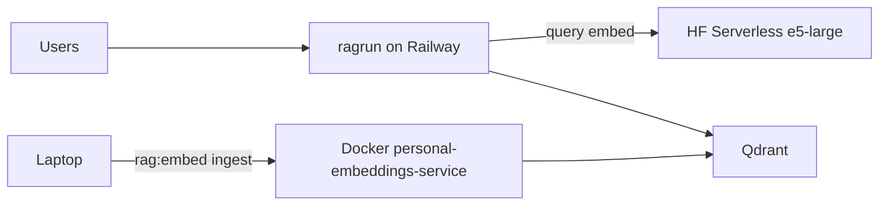

# HF Serverless Embeddings (aktueller Versuch)

Near-term-Pfad aus [EMBEDDINGS_HOSTING.md](EMBEDDINGS_HOSTING.md).

## Ziel

Query-Embeddings über Hugging Face Inference Providers; gleiches Modell wie Qdrant-Vektoren; Ingest nicht über HF.

## Architektur

Heute teilen Query und Ingest dieselbe `RAGRUN_EMBEDDINGS_BASE_URL` ([`app/infra/embedding_client.py`](../../app/infra/embedding_client.py)). Für den Split:

- Production/Staging: HF (Adapter oder dünner Proxy mit `/api/v1/embeddings`)
- Lokales Embed: Docker auf dem Laptop; `rag:embed` nur gegen lokales ragrun bzw. lokales Embeddings-URL

## Umsetzungsschritte

1. **Kompatibilitätstest:** `python scripts/compare_hf_embeddings.py` (needs `HF_TOKEN`; optional local `:8001`). Unit: `tests/test_hf_embedding_pooling.py` (mean-pool + L2).
2. **Adapter:** `RAGRUN_EMBEDDINGS_PROVIDER=huggingface` → [`app/infra/hf_embedding.py`](../../app/infra/hf_embedding.py) via [`EmbeddingClient`](../../app/infra/embedding_client.py); retries on 429/502/503.
3. **Env:** `RAGRUN_HF_TOKEN` / `HF_TOKEN`; see [`.env.staging`](../../.env.staging) / [`.env.dev`](../../.env.dev).
4. **Retries:** built into `HuggingFaceEmbeddingBackend`.
5. **Guardrail:** `_reject_hf_batch_ingest` on `/rag/embed-chunks` when `RAGRUN_EMBEDDINGS_HF_FORBID_INGEST=true` (default); client also refuses batches &gt; `RAGRUN_EMBEDDINGS_HF_MAX_BATCH_TEXTS`.
6. **Smoke:** `/healthz` reports `embedding_service.status=configured` for HF; retrieval uses query embeds only.

## Nicht tun

- Modal wieder warm starten
- 50k-Ingest über HF Free/PRO-Credits
- Modellwechsel ohne Re-Embed

## Exit zu Future

Bei chronischen Limits, Latenz oder Kosten → [HOME_GPU_EMBEDDER.md](HOME_GPU_EMBEDDER.md).
