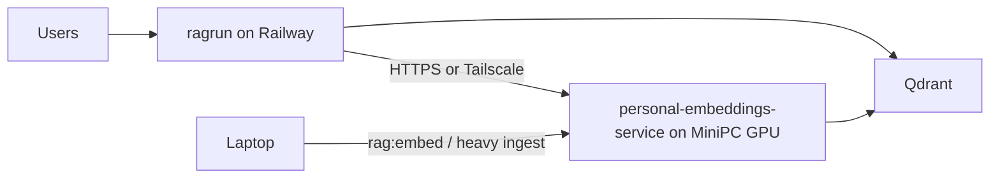

# Home-GPU Embedder (Mini-PC) — Future / Hinterhand

Reserve-Pfad aus [EMBEDDINGS_HOSTING.md](EMBEDDINGS_HOSTING.md). **Nicht jetzt umsetzen**, solange HF Serverless reicht.

## Entscheidung (wenn aktiviert)

- **Host:** Always-on Mini-PC / SFF mit dedizierter NVIDIA-GPU.
- **Modal:** bleibt gestoppt — keine Idle-T4-Kosten.
- **Modell:** unverändert `intfloat/multilingual-e5-large` (1024d).
- **Stack:** [`personal-embeddings-service`](../../personal-embeddings-service/) per Docker + NVIDIA Container Toolkit.

## Hardware-Ziel (Kauf)

e5-large braucht ~2 GB VRAM; Query- und Batch-Ingest auf Einstiegs-GPU.

- **GPU:** NVIDIA **≥8 GB VRAM** (z. B. RTX 3060 12 GB, RTX 4060 8 GB; mobil oft „4060 Laptop“).
- **RAM:** ≥16 GB (32 GB angenehmer).
- **Storage:** NVMe ≥256 GB (Modellcache + Docker).
- **Formfaktor:** Mini-PC mit dGPU (Minisforum / ASUS / …) oder kleines ITX/SFF — entscheidend: **NVIDIA + Docker-GPU**.
- **Leistung:** Query typisch zehn–hundert ms; 50k Chunks Ingest in Minuten (vs. Pi/CPU).
- **Budget-Ballpark:** oft ~€600–1200 je nach GPU; Strom dauerhaft weit unter warmer Cloud-T4.

Optional: gleicher Rechner beim lokalen Provider im Rack + VPN — Software-Pfad identisch.

## Laufzeit-Architektur

- Production/Staging: `RAGRUN_EMBEDDINGS_BASE_URL` → Heim-/Provider-URL.
- Ingest und Queries auf **demselben** Host.
- Auth: Tailscale oder Cloudflare Tunnel + Access; Endpoint nicht ungeschützt öffentlich.

## Software-Schritte (nach Hardware)

1. Ubuntu (o. ä.) + NVIDIA Driver + NVIDIA Container Toolkit.
2. Repo auschecken, Modell einmal laden, `docker compose up` mit GPU.
3. Erreichbarkeit: Tailscale (einfach für Railway→Heim) oder Cloudflare Tunnel + Access.
4. Railway Staging/Production: `RAGRUN_EMBEDDINGS_BASE_URL` von HF/Modal auf Heim-URL ([`.env.staging`](../../.env.staging)).
5. Smoke: `GET /api/v1/health/simple`, Query-Embed, kurzer Retrieval-Test.
6. Docs: Kostenzeile in [`THREE_TIER_DEPLOYMENT.md`](../THREE_TIER_DEPLOYMENT.md) anpassen; Modal als deprecated/stopped vermerken.

## Was wir nicht tun

- Modal nicht wieder mit `min_containers=1` starten.
- Kein Modellwechsel / kein Re-Embed nur wegen Host-Wechsel.
- Kein Railway always-on CPU-Embedder (~$60–120/Monat) als Dauerlösung.
- DeepSeek v4 nicht lokal auf diesem Rechner (braucht ~90–180 GB VRAM) — weiter API.

## Risiko / Betrieb

- Heimnetz/Strom/ISP: Single Point of Failure.
- Mitigation: HF als Fallback oder zweites Gerät — optional später.

## Todos (wenn aktiviert)

- [ ] Mini-PC/SFF mit NVIDIA ≥8 GB VRAM + 16 GB RAM spezifizieren/beschaffen
- [ ] Driver + Container Toolkit + Service mit GPU starten, Modell cachen
- [ ] Tailscale oder Cloudflare Tunnel; Endpoint absichern
- [ ] `RAGRUN_EMBEDDINGS_BASE_URL` Staging/Production umstellen
- [ ] Health/Retrieval-Smoke; Deployment-Docs aktualisieren
